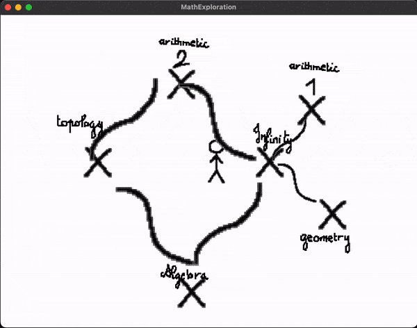

# MathExploration

MathExploration is an immersive and educational C++ game built using OpenGL (GLEW and GLFW) that takes players on an exciting journey through the vast world of mathematics. Designed with a focus on learning through exploration, the game integrates mathematical themes into progressively challenging levels, making math engaging, interactive, and fun.



## Features

### 🌌 **Mathematical Themes**
Each level introduces a unique mathematical concept, including but not limited to:
- Arithmetics
- Algebra *(soon)*
- Geometry *(soon)*
- Trigonometry *(soon)*
- Probability and Statistics *(soon)*
- Linear Algebra *(soon)*
- Number Theory *(soon)*
- Combinatorics *(soon)*

### 🎮 **Interactive Gameplay**
Solve puzzles, uncover mysteries, and tackle mathematical challenges as you explore beautifully crafted worlds that represent mathematical concepts visually and interactively.

### 🛠️ **Entity-Component-System Architecture**
Built with an Entity-Component-System (ECS) architecture, the game is highly modular and efficient, ensuring smooth gameplay and scalability for future expansions.

### 💻 **Powered by OpenGL**
MathExploration leverages the power of OpenGL for stunning visual effects and smooth rendering, creating an engaging and dynamic game environment. GLEW and GLFW are used for seamless graphics management and input handling.

### 🖥️ **Mac Compatibility**
Currently optimized for macOS, MathExploration offers a polished experience for macOS users. Future plans include expanding to other platforms.

## Getting Started

### Prerequisites
Before you can run MathExploration, ensure you have the following installed on your macOS system:
- **GLEW** (OpenGL Extension Wrangler Library)
- **GLFW** (OpenGL Framework)

### Installation
1. Clone the repository:
   ```bash
   git clone https://github.com/MailiTruong/MathExploration.git
   cd MathExploration
   ```

2. Build the game using Make:
   ```bash
   make
   ```

3. Run the game:
   ```bash
   ./bin/math_exploration
   ```

### Controls
- **WASD**: Move character
- **Enter**: Send your anwser
- **Space**: Restart
- **G**: Interact with objects
- **Esc**: Quit the game

## Game Structure

### Levels
Each level is designed to represent a mathematical domain. For example:
- **Level 1: Arithmetic's sheep farm** - Count sheep.

### Visual Style
The game's visuals are crafted to represent mathematical beauty:
- Drawing to make Mathematics look childish.

## Roadmap
- [ ] Add releases for Windows and Linux
- [ ] Expand levels to include advanced topics like Topology and Abstract Algebra
- [ ] Implement multiplayer mode for collaborative problem-solving
- [ ] Create a level editor for user-generated content

## License
This project is licensed under the [Apache-2.0](LICENSE).

---

Embark on an adventure through the wonders of mathematics. Download MathExploration today and start your journey!


